# Abdullah Alghamdi

### `NVX-11`

---

## about

I'm focused on cloud infrastructure, DevOps, and automation.

Most of what I work with revolves around AWS, Terraform, Kubernetes, CI/CD, and infrastructure security.

Right now, I'm spending more time strengthening the fundamentals behind the tools: **Linux, networking, and troubleshooting.**

---

## the toolbox

  

`Prometheus` · `Grafana` · `Argo CD` · `Vault` · `Cloudflare` · `Azure`

---

## certifications

&nbsp;&nbsp;&nbsp;&nbsp;&nbsp;&nbsp;&nbsp;&nbsp;

---

## elsewhere

  

 

